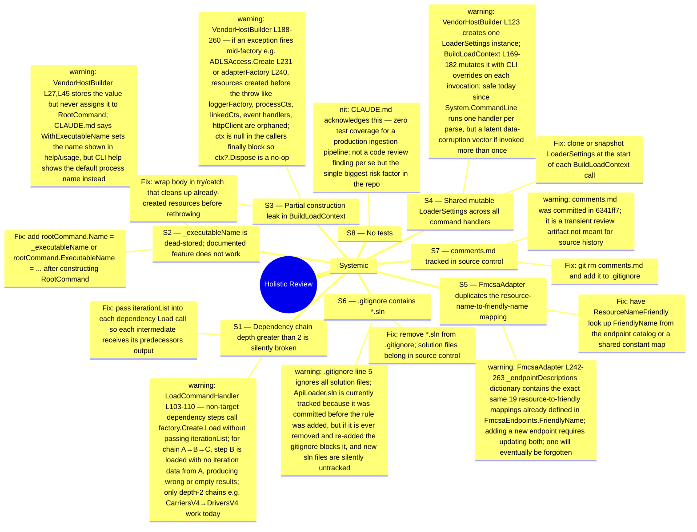
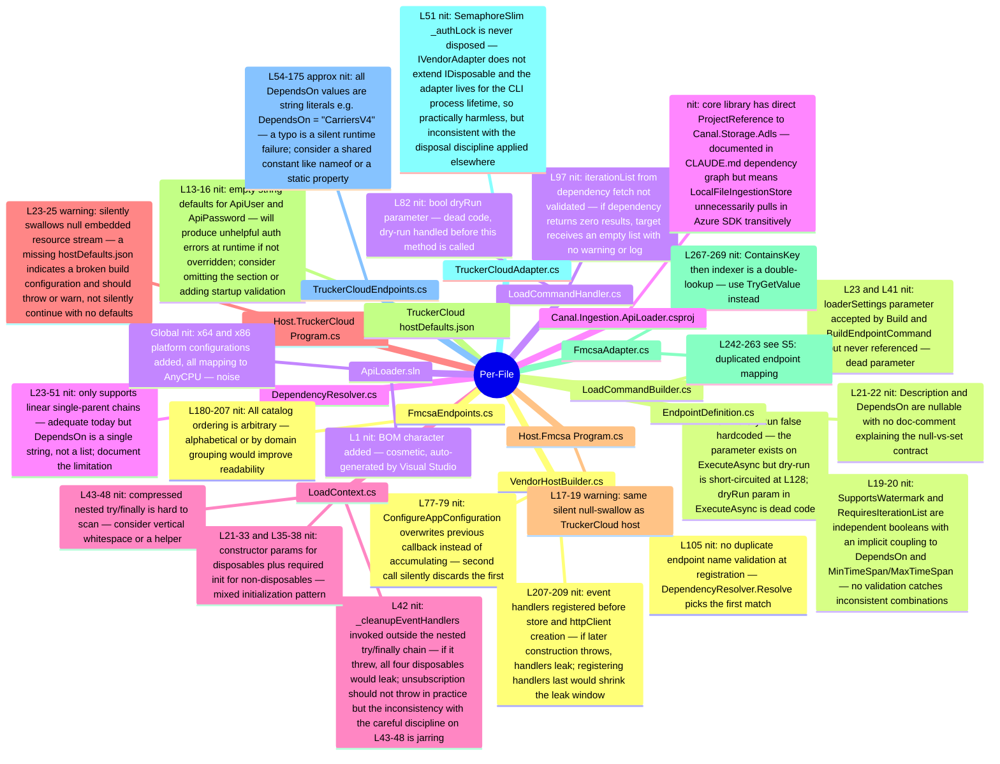

# Holistic Code Review — Full Repo State at a37359c

**Scope:** All ~20 commits (f103f00..a37359c). Full codebase read. Build: **clean (0 warnings, 0 errors).**
**Working tree:** `comments.md` modified (this file).

---

## Systemic / Architectural

---

## Per-File Findings

---

## Priority Summary

| Severity | Count | Key items |
|----------|-------|-----------|
| Blocker  | 0     | Build clean, prior blockers resolved |
| Warning  | 8     | S1 chain depth>2, S2 dead _executableName, S3 partial construction leak, S4 mutable shared settings, S5 FmcsaAdapter DRY, S6 gitignore *.sln, S7 comments.md tracked, silent null-swallow in both hosts |
| Nit      | 18    | Dead params, string DependsOn, disposal formatting, double-lookup, SemaphoreSlim, endpoint ordering, implicit coupling, doc gaps, sln noise, core→ADLS coupling |

## Top 3 Recommended Actions

1. **Fix S1 (chain depth>2)** — Correctness bug. Pass `iterationList` through each chain step. One-line change in LoadCommandHandler.
2. **Fix S2 (_executableName)** — Wire it to `RootCommand` or remove the builder method and its CLAUDE.md docs. Currently a documented feature that does nothing.
3. **Fix S6+S7 (.gitignore)** — Remove `*.sln` from `.gitignore`; `git rm comments.md` and add `comments.md` to `.gitignore`.
